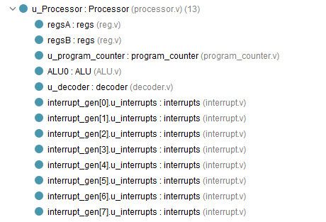
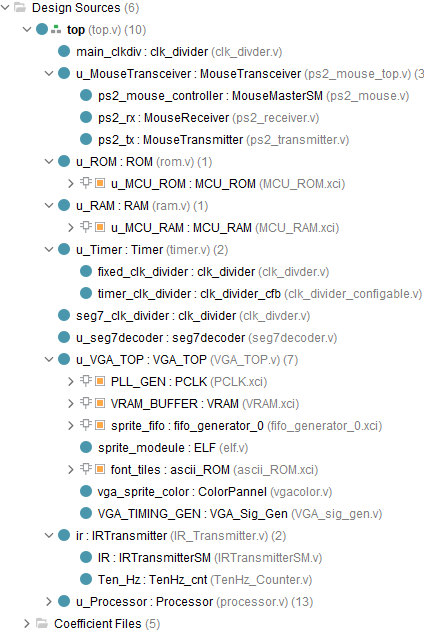

# microprocessor-rc

### ip:
1. block ram -> mcu ram
2. block rom -> mcu rom
3. block ram -> vga ram
4. block rom -> vga text tiles(ascii)
5. fifo -> vga data transfer

### cpu: instruction
```cpp
/*------------------------------------------------------------------------------
|    No.|    Name   |            Explain                |     Machine code     | 
|     0 | MOVa addr | Read from memory to A             | 0000 0000  xxxx xxxx |
|     1 | MOVb addr | Read from memory to B             | 0000 0001  xxxx xxxx |
|     2 | sbA addr  | Write to memory from A            | 0000 0010  xxxx xxxx |
|     3 | sbB addr  | Write to memory from B            | 0000 0011  xxxx xxxx |
|     4 | OpA       | ALU Op, and save result in reg A  | xxxx 0100            |
|     5 | OpB       | ALU Op, and save result in reg B  | xxxx 0101            |
| added | Op Addr   | ALU Op, and save result to memory | xxxx 1111  xxxx xxxx |
|     6 |beq bne blt| if A (== or < or > B) GoTo ADDR   | xxxx 0110  xxxx xxxx |
|     7 | JAL addr  | Goto ADDR                         | 0000 0111  xxxx xxxx |
|     8 | NOP       | Go to IDLE                        | 0000 1000            |
|     9 | Halt      | NOP and wait for interrupt        | 0000 1101            |
|    10 | Call addr | Function call                     | 0000 1001  xxxx xxxx |
|    11 | Ret       | Return from function call         | 0000 1010            |
|    12 | lbA       | Dereference A                     | 0000 1011            |
|    13 | lbB       | Dereference B                     | 0000 1100            |
------------------------------------------------------------------------------*/
```


### structure
 